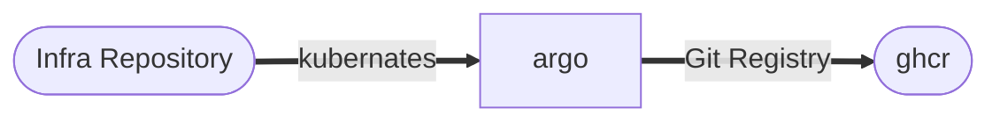
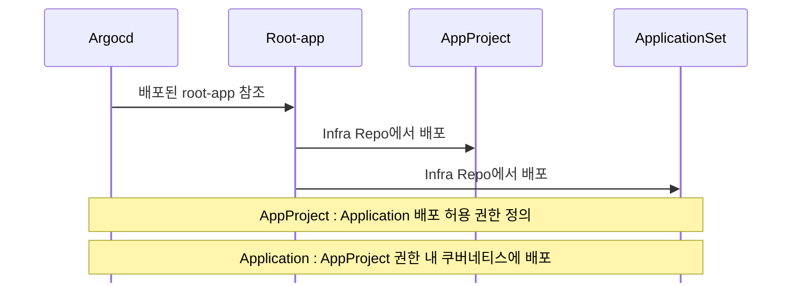

# 이미지 pull 필수 Secret 
## ghcr-creds 
- helm 에서 반복해서 각 namespace 마다 배포 해야 한다.
- ImagePullSecret 접근시 같은 Namespace 의 Secret을 참조해야하기 때문
``` yaml
apiVersion: v1  
kind: Secret  
metadata:  
  name: ghcr-creds  
  namespace: {{ $val }}  
# Registry 전용 Secret Type
# Pod private Image pull 시 imagePullSecrets 로 참조
type: kubernetes.io/dockerconfigjson
stringData:
  .dockerconfigjson: |
    {
      "auths": {
        "ghcr.io": {
          "auth": <GHCR TOKEN ON BASE64>
        }
      }
    }
```

# ArgoCD 필수 Secret
## Argo Secret
- ArgoCD 에서 repo 참조시 필요한 정보
- 레지스트리 사이트 이름
- repo url
- username
- password 

``` yaml
apiVersion: v1
kind: Secret
metadata:
  name: <ArgoCD Secret Name>
  namespace: argocd
  labels:
    # prefix/name 
    argocd.argoproj.io/secret-type: repository
stringData:
  type: git
  url: https://github.com/<REPO OWNER>/<INFRA PROJECT NAME>
  username: <REPO OWNER>
  password: <INFRA READ PAT>
```

# 아키텍처
## ArgoCD Pull Image 


## ArgoCD Pulling Process
